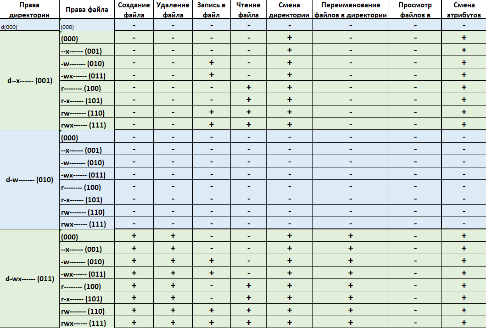
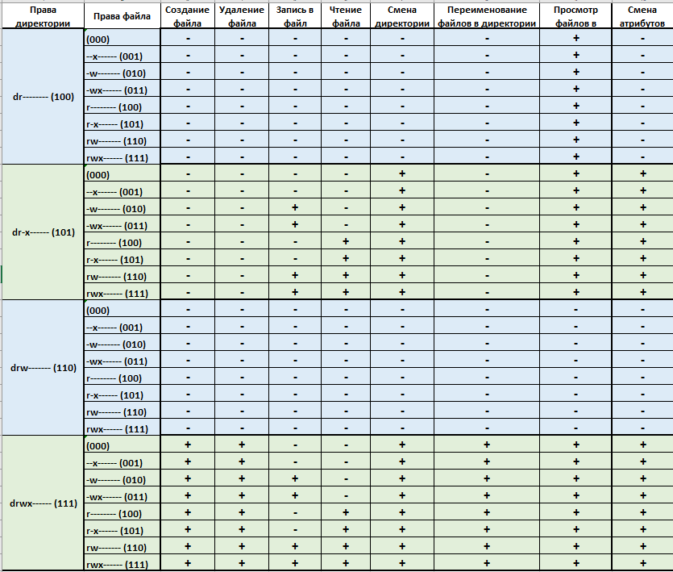
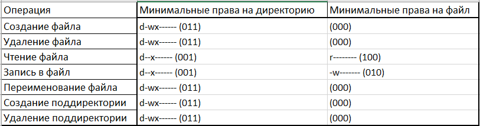

---
## Front matter
title: Лабораторная работа №2
author: |
	Силкина Мария Александровна
date: 30.09.2021

## Formatting
toc: false
slide_level: 2
theme: metropolis
header-includes: 
 - \metroset{progressbar=frametitle,sectionpage=progressbar,numbering=fraction}
 - '\makeatletter'
 - '\beamer@ignorenonframefalse'
 - '\makeatother'
aspectratio: 43
section-titles: true
---

# Дискреционное разграничение прав в Linux. Основные атрибуты.

## Цель выполнения лабораторной работы

- Приобрести практические навыки работы в консоли с атрибутами файлов, закрепление теоретических основ дискреционного разграничения доступа в современных системах с открытым кодом на базе ОС Linux.

## Задачи выполнения работы

1. Выполнить лабораторную работу по заданному порядку: создать учетную запись, создать директории, изучить основные команды для работы с атрибутами.

2. Заполнить две таблицы по теме прав в ОС Linux.

## Полученные таблицы 

- 1 из 3

{ #fig:001 width=70% }

##  

- 2 из 3

{ #fig:002 width=70% }

##

- 3 из 3

{ #fig:003 width=70% }

## Результаты выполнения лабораторной работы

- При выполнении данной лабораторной работы я получила практические навыки работы в консоли с атрибутами файлов, закрепление теоретических основ дискреционного разграничения доступа в современных системах с открытым кодом на базе ОС Linux.