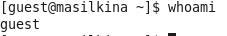

---
# Front matter
title: "Лабораторная работа №2."
subtitle: "Дискреционное разграничение прав в Linux. Основные атрибуты"
author: "Силкина Мария Александровна"

# Formatting
toc-title: "Содержание"
toc: true # Table of contents
toc_depth: 2
lof: true # List of figures
lot: true # List of tables
fontsize: 12pt
linestretch: 1.5
papersize: a4paper
documentclass: scrreprt
polyglossia-lang: russian
polyglossia-otherlangs: english
mainfont: PT Serif
romanfont: PT Serif
sansfont: PT Sans
monofont: PT Mono
mainfontoptions: Ligatures=TeX
romanfontoptions: Ligatures=TeX
sansfontoptions: Ligatures=TeX,Scale=MatchLowercase
monofontoptions: Scale=MatchLowercase
indent: true
pdf-engine: lualatex
header-includes:
  - \linepenalty=10 # the penalty added to the badness of each line within a paragraph (no associated penalty node) Increasing the value makes tex try to have fewer lines in the paragraph.
  - \interlinepenalty=0 # value of the penalty (node) added after each line of a paragraph.
  - \hyphenpenalty=50 # the penalty for line breaking at an automatically inserted hyphen
  - \exhyphenpenalty=50 # the penalty for line breaking at an explicit hyphen
  - \binoppenalty=700 # the penalty for breaking a line at a binary operator
  - \relpenalty=500 # the penalty for breaking a line at a relation
  - \clubpenalty=150 # extra penalty for breaking after first line of a paragraph
  - \widowpenalty=150 # extra penalty for breaking before last line of a paragraph
  - \displaywidowpenalty=50 # extra penalty for breaking before last line before a display math
  - \brokenpenalty=100 # extra penalty for page breaking after a hyphenated line
  - \predisplaypenalty=10000 # penalty for breaking before a display
  - \postdisplaypenalty=0 # penalty for breaking after a display
  - \floatingpenalty = 20000 # penalty for splitting an insertion (can only be split footnote in standard LaTeX)
  - \raggedbottom # or \flushbottom
  - \usepackage{float} # keep figures where there are in the text
  - \floatplacement{figure}{H} # keep figures where there are in the text
---

# Цель работы

Приобрести практические навыки работы в консоли с атрибутами файлов, закрепление теоретических основ дискреционного разграничения доступа в современных системах с открытым кодом на базе ОС Linux.

# Задачи

1. Выполнить последовательно лабораторную работу по заданному алгоритму.

2. Ознакомиться с атрибутами и правами и заполнить таблицы из лабораторной.

# Выполнение лабораторной работы 

В данной лабораторной работе я решила идти по порядку, заданному в инструкции. Сначала я создала в командной строке учетную запись пользователя guest с помощью команды useradd и passwd (рис 1. -@fig:001).

{ #fig:001 width=70% }

Далее, мне нужно было войти в эту учетную запись (рис 2. -@fig:002). 

{ #fig:002 width=70% }

С помощью команды pwd я посмотрела в какой директории я нахожусь. Она не похожа на приглашение командной строки и является домашним каталогом для пользователя guest (рис 3. -@fig:003).

{ #fig:003 width=70% }

Следующим  шагом я уточнила имя пользователя с помощью команды whoami (рис 4. -@fig:004).

{ #fig:004 width=70% }

С помощью командной строки узнала uid, gid и тд с поммощью команды id (рис 5. -@fig:005).

{ #fig:005 width=70% }

Для сравнения воспользовалась командой groups (рис 6. -@fig:006).

{ #fig:006 width=70% }

Посмотрела файл /etc/passwd с помощью команды cat. Нашла в нем свою учетную запись. Определила uid и gid. Они были идентичны тем, что я получила шагом выше. Также воспользовалась командой с фильтром для удобства поиска cat /etc/passwd | grep guest (рис 7. -@fig:007).

{ #fig:007 width=70% }

Определила существующие в системе директории командой ls -l /home/. Мне удалось получить список поддиректорий, в котором были директории моих двух учетных записей masilkina и guest. Проверила расширенные атрибуты, установленные на поддиректориях. Мне удалось увидеть их только для директории guest (рис 8. -@fig:008).

{ #fig:008 width=70% }

Создала в домашней директории поддиректорию dir1 командой mkdir dir1. Определила командами ls -l и lsattr, какие права доступа и расширенные атрибуты были выставлены на директорию dir1 (рис 9. -@fig:009).

{ #fig:009 width=70% }

Сняла с директории dir1 все атрибуты командой chmod 000 dir1 и проверила правильность выполнения командой ls -l (рис 10. -@fig:010).

{ #fig:010 width=70% }

Следующим шагом попыталась создать файл, но получила отказ из-за того, что сняла все атрибуты с директории и не могу с ней больше ничего делать. Однако файл создался, но не записался (рис 11. -@fig:011).

{ #fig:011 width=70% }

Следующие задания были посвящены заполнению таблиц по правам на файлы и директории. Я заполнила таблицы (рис 12. -@fig:012). (рис 13. -@fig:013).

{ #fig:012 width=70% }

{ #fig:013 width=70% }

В последней таблице нужно было подытожить указав какие минимальные права требуются на совершение определенных операций (рис 14. -@fig:014).

{ #fig:014 width=70% }

# Выводы

При выполнении данной лабораторной работы я получила практические навыки работы в консоли с атрибутами файлов, закрепление теоретических основ дискреционного разграничения доступа в современных системах с открытым кодом на базе ОС Linux.